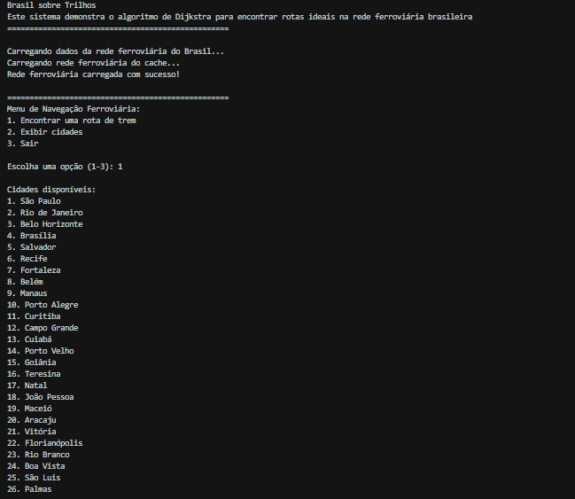
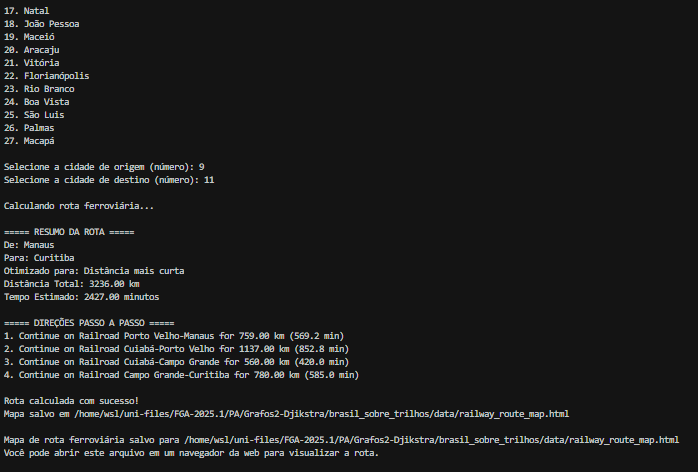
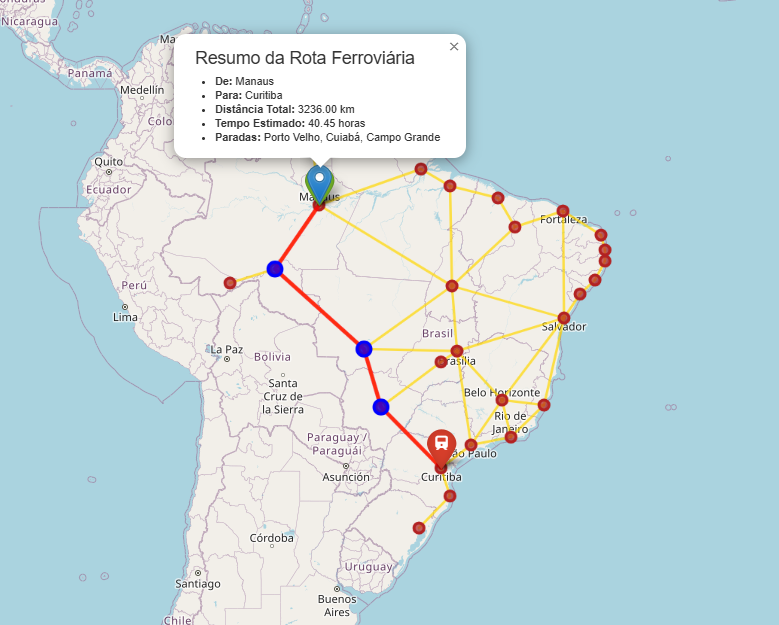

# Brasil Sobre Trilhos

**Número da Lista**: Grafos 2

**Conteúdo da Disciplina**: Grafos 2 - Algoritmo de Dijkstra

## Alunos

| Matrícula  | Aluno                     |
| ---------- | ------------------------- |
| 20/0056981 | Arthur Ferreira Rodrigues |
| 19/0084731 | Augusto Durães Camargo    |

## Sobre

Este projeto demonstra a aplicação do Algoritmo de Dijkstra em um contexto prático: um sistema de navegação ferroviária brasileira. O sistema modela uma rede fictícia de ferrovias conectando as principais capitais brasileiras, permitindo ao usuário encontrar a rota mais eficiente entre duas cidades.

O projeto utiliza grafos para representar cidades (nós) e ferrovias (arestas), e implementa o Algoritmo de Dijkstra para calcular o caminho mais curto entre os pontos selecionados.

## Screenshots





## Instalação

**Linguagem**: Python 3.8+

**Frameworks/Bibliotecas**: NetworkX, Folium, Pandas, GeoPandas, Matplotlib

### Pré-requisitos

- Python 3.8 ou superior
- Pip (gerenciador de pacotes do Python)

### Passos para instalação

1. Clone o repositório

2. Instale as dependências

   ```bash
      pip install -r requirements.txt
   ```

## Uso

Para executar o sistema, utilize o comando:

```bash
python src/main.py
```

### Passo a passo de uso

1. No menu principal, selecione a opção "1" para encontrar uma rota entre cidades
2. Escolha a cidade de origem pelo número correspondente
3. Escolha a cidade de destino pelo número correspondente
4. Selecione o critério de otimização (distância ou tempo)
5. O sistema calculará e exibirá a rota ideal usando o Algoritmo de Dijkstra
6. Uma visualização da rota será salva como um arquivo HTML que pode ser aberto em qualquer navegador

Você também pode visualizar a lista completa de cidades disponíveis selecionando a opção "2" no menu principal.

## Outros

O projeto simula uma rede ferroviária idealizada para o Brasil, conectando todas as capitais do país. Embora as distâncias e tempos de viagem sejam aproximados, o sistema demonstra efetivamente como o Algoritmo de Dijkstra pode ser aplicado para resolver problemas de caminho mais curto em redes de transporte.

### Características Técnicas

- Implementação eficiente do Algoritmo de Dijkstra usando a biblioteca NetworkX
- Visualização interativa das rotas usando Folium (mapas interativos)
- Interface de linha de comando simples e intuitiva
- Capacidade de otimizar rotas por distância
